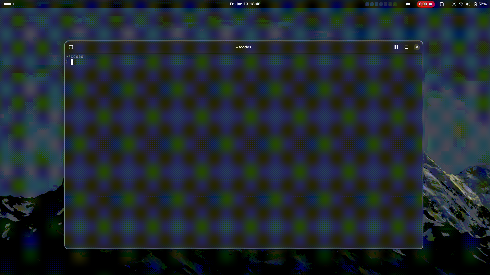

# Go Fuzzy Finder

## Preview


## Project Description
This Go project implements a fuzzy searching algorithm and provides a user interface for interacting with the search functionality.
Using concurrency for improved performance when loading files. By using a worker pool to scan directories concurrently and collecting results through channels, the application can handle large directories more efficiently and provide faster search results.

## Installation Instructions
### Install directly with go
```
go install github.com/yagnik-patel-47/fzf-cli@latest
```
### Install by building locally
1. Clone the repository:
```
git clone https://github.com/yagnik-patel-47/fzf-cli.git
```
2. Navigate to the project directory:
```
cd fzf-cli
```
3. Install the dependencies:
```
go mod tidy
```

## Usage Examples
To run the application, use the following command:
```
fzf-cli
```
### OR
```
go run main.go
```
To build the application, use the following command:
```
go build
```
Once the application is running, you can input your search queries, and the application will display the matching results based on the fuzzy search algorithm.

## Contribution Guidelines
1. Fork the repository.
2. Create a new branch for your feature or bug fix:
```
git checkout -b feature/YourFeature
```
3. Make your changes and commit them:
```
git commit -m "Add your message here"
```
4. Push to the branch:
```
git push origin feature/YourFeature
```
5. Create a pull request detailing your changes.
